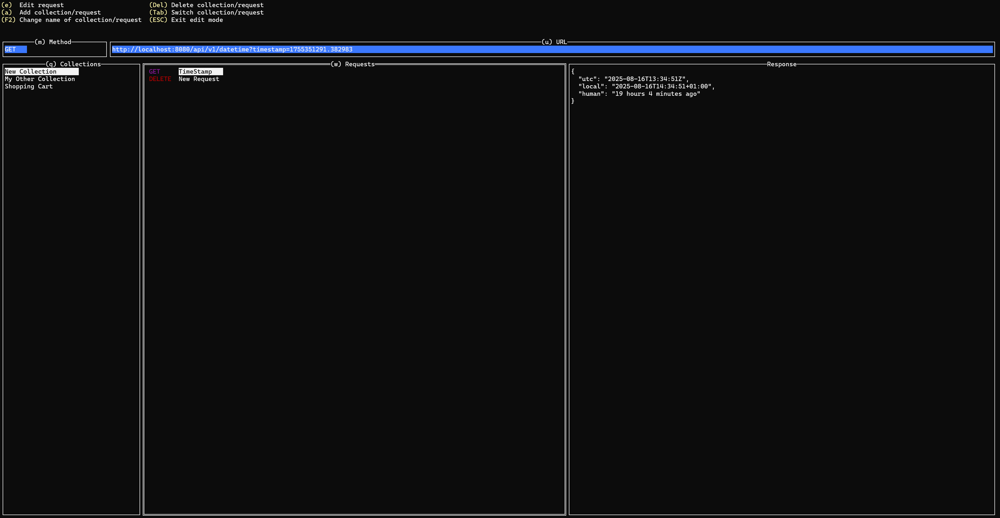

# Snap RQ (TUI)

## Disclamer

This project was an exploratory work to understand whether it is feasable to use `tview` to create an REST API testing client for terminal application. While the basic features work, there is an enormous amount of features which were not implemented due to the large amount of evidence that developing such an application with `tview` at this point in time is unfeasable due to the lack of maturity and signs of the library abandonment.

Features such as environment variables, undo/redo operations, copy and paste ops, contextual help are not supported. Furthermore, this application may have bugs and is strongly adviced not to rely on using it on production environments due to concerns about data integrity and lack of security features.

With that said, you can still have fun exploring it. All contributions are welcome.

## Intro



This is a small REST API testing client. It has the basic features to allow adding/removing/editing requests and collections with the ability to use GoLang's net/http client to make HTTP requests to specified URLs.

## Hotkeys

- q: Focus on collections list
- w: Focus on requests list
- u: Focus on URL
- m: Focus on Request Method
- e: Edit selected request
- Up Arrow/Down Arrow: scroll navigate up and down the lists of collections/requests
- h: Change to edit headers (When editing a request)
- b: Change to edit body (When editing a request)
- TAB: Switch between collections/requests
- F2: Change collection name
- DEL: Delete collection/request (careful, there is no undo)
- a: Add collection/request
- Ctrl-C: Exit (Every change is stored on key strokes, so don't worry about losing something)

## Building and Running

- To build and run for Windows, run `b.bat`
- To build and run for Linux, run `b`

## Debugging

1. Start delve headless `dlv debug --headless --listen=:2345 --log --api-version=2 main.go`
2. Attach VSCode to delve. Add this launch.json

```
{
  "configurations": [
    {
      "name": "My remote debug",
      "type": "go",
      "request": "attach",
      "mode": "remote",
      "remotePath": "${workspaceFolder}",
      "port": 2345,
      "host": "127.0.0.1"
    }
  ]
}

```

## License

This project is licensed under the MIT License.

MIT License

Copyright (c) 2025 [Ivo Ganev]

Permission is hereby granted, free of charge, to any person obtaining a copy
of this software and associated documentation files (the "Software"), to deal
in the Software without restriction, including without limitation the rights
to use, copy, modify, merge, publish, distribute, sublicense, and/or sell
copies of the Software, and to permit persons to whom the Software is
furnished to do so, subject to the following conditions:

The above copyright notice and this permission notice shall be included in all
copies or substantial portions of the Software.

THE SOFTWARE IS PROVIDED "AS IS", WITHOUT WARRANTY OF ANY KIND, EXPRESS OR
IMPLIED, INCLUDING BUT NOT LIMITED TO THE WARRANTIES OF MERCHANTABILITY,
FITNESS FOR A PARTICULAR PURPOSE AND NONINFRINGEMENT. IN NO EVENT SHALL THE
AUTHORS OR COPYRIGHT HOLDERS BE LIABLE FOR ANY CLAIM, DAMAGES OR OTHER
LIABILITY, WHETHER IN AN ACTION OF CONTRACT, TORT OR OTHERWISE, ARISING FROM,
OUT OF OR IN CONNECTION WITH THE SOFTWARE OR THE USE OR OTHER DEALINGS IN THE
SOFTWARE.
